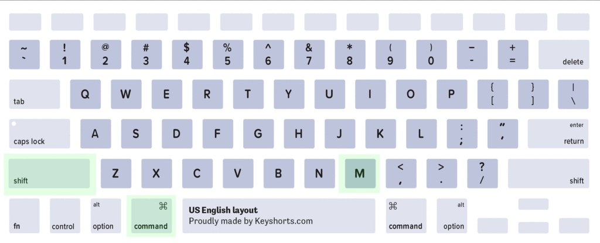

```{r, include = F}
knitr::opts_chunk$set(fig.width = 6, message = FALSE, warning = FALSE, comment = "", cache = FALSE, fig.retina = 3)
library(flipbookr)
library(tidyverse)
library(flair)
library(kableExtra)
```
```{r xaringan-themer, include=FALSE, warning=FALSE}
library(xaringanthemer)
style_duo_accent(
  #base_color = "#43a2ca",
  header_font_google = google_font("Mukta"),#Ubuntu Condensed
  text_font_google   = google_font("Montserrat", "300", "300i"),
  code_font_google   = google_font("Fira Mono"),
  primary_color      = "#0F4C81", # pantone classic blue
  secondary_color    = "#b3e2cd", # pantone baby blue
  #header_font_google = google_font("Raleway"),
  #text_font_google   = google_font("Raleway", "300", "300i"),
  #code_font_google   = google_font("Source Code Pro"),
  text_font_size     = "25px"
#   colors = c(
#   red = "#f34213",
#   purple = "#3e2f5b",
#   orange = "#ff8811",
#   green = "#136f63",
#   white = "#FFFFFF",
# )
)

```

```{r, include=FALSE}
text_spec2 <- function(x = "x"){
  text_spec(x, background = "#b3e2cd", bold = T)
}
```

```{r echo = FALSE}
library(readr) # cargo el paquete
listado <- read_csv("data/listings.csv") #importo los datos
```


# ¿Qué haremos hoy?

- Repaso del segundo taller 
<br><br>
--

- Encadenar funciones: operador %>%
<br><br>
--

- Crear una variable a partir de ciertas condiciones: case_when()
<br><br>
--

- Recodificar y renombrar variables
<br><br>
--

- Exportar objetos a archivos Rdata. Importar archivos Rdata.
<br><br>
--

- Unir dos data frame 
<br><br>
--

- Buenas prácticas a la hora de escribir código

---
class: inverse, center, middle
# %>%

---
# Encadenamiento de funciones en lugar de anidación

El operador `r text_spec2("%>%")`, llamado `r text_spec2("pipe")` (significa tubería) permitirá `r text_spec2("encadenar funciones")` en lugar de colocar una dentro de otra sin una a continuación de la otra.
<br><br>
--

- El pipe estructura una secuencia de operaciones sobre los datos de `r text_spec2("izquierda a derecha")`.
<br><br>
--

- A diferencia de la anidación de funciones que implica operaciones de adentro para afuera. 
<br><br>
--

- En lugar de f(x): `r text_spec2("x %>% f()")`
<br><br>
--

---
# Pipe: atajo de teclado en Linux/Windows


---
# Pipe: atajo de teclado en Mac


---
# Armar un mate con y sin 'pipe'

El `r text_spec2("mate")` es el `r text_spec2("data frame")`, los `r text_spec2("verbos")` de dplyr (así se llaman a las funciones que vimos) son las acciones que necesitamos para armarlo: poner la yerba, poner un poco de agua, dejarlo hinchar, poner la bombilla, cebar.
--

```{r eval=FALSE}
# Mate con 'pipe'

mate %>% 
        poner_yerba() %>%
        hinchar() %>%
        colocar_bombilla() %>%
        cebar()
```

--

En R base y sin el pipe tendríamos que conctenar estas funciones. Cuando las funciones están concatenadas el orden se obtiene de adentro hacia afuera.

```{r eval=FALSE}
# Mate sin 'pipe'

cebar(colocar_bombilla(hinchar(poner_yerba(mate))))
```

<!-- [magrittr](https://github.com/tidyverse/magrittr/blob/master/vignettes/magrittr.Rmd) -->

---
# Rehacemos los ejemplos usando %>%

- Agrupo por barrio y calculo el promedio de precio
--

- Sin el pipe teníamos:

```{r eval = FALSE}
summarise(group_by(listado, neighbourhood), promedio = mean(price)) #<<
```
--

- Con el pipe tenemos:

```{r eval = FALSE}
listado %>% #<<
  group_by(neighbourhood_group) %>% #<<
  summarise(promedio_gr = mean(price)) #<<
```

```{r echo=FALSE}
#encuesta %>%
#group_by(r) %>%
#mutate(media_edad = mean(edad)) %>%
#filter(edad == media_edad) %>% 
#  ungroup()
```

---
# Ejercicio (6')

Rehacer los ejercicios anteriores usando el pipe

- Selecciona los casos que tienen entre de 10 y 20 evaluaciones y guarda en un objeto llamado review_10_20.

- Selecciona los casos que tienen solo 3 ó 5 días de disponibilidad y guarda en un objeto llamado availability_3_5.

- Selecciona los últimos 5 casos de listado y guarda en un objeto llamado last_5.

- Selecciona las variables referidas a reviews y guarda en un objeto llamado reviews_name.

- ¿Cuál es el alojamiento con mayor número de evaluaciones? Ver ?slice_max

---
# Ejercicio (6')

- Calcula la variable precio en dólares estadounidenses y llamala price_uss. Toma la cotización 1 euro - 1.13 dólares. Calcula la variable precio en pesos uruguayo y llamala price_pesos. Toma la cotización 1 euro - 49 pesos.

- ¿Cuál es el máximo y mínimo de evaluaciones que ha recibido un alojamiento?

- Calcula los precios precios promedios y máximos por barrio

- Calcula los precios precios promedios y máximos por tipo de alojamiento 

---
class: inverse, center, middle
# dplyr::case_when()

---
# Crear una variable a partir de varias condiciones

La función `r text_spec2("case_when()")` permite calcular una nueva variable a partir de condicionar los valores de otra

```{r}
listado <- listado %>% 
  mutate( #<<
   disponible = case_when( #<<
     availability_365 < 1 ~ "No disponible", #<<
     availability_365 >= 1 ~ "Disponible")) #<<
```


- Chequeo

```{r eval = FALSE}
listado %>% count(disponible)
```

---
# Ejercicio (5')


- Crear la variable `price_range` con las siguientes categorias: bajo, medio-bajo, medio, medio y alto.

- Traducir las categorías de `room_type` y en una nueva variable llamada `room_tpye_sp`


---
class: inverse, center, middle
# dplyr::recode()

---
# Recodificar una variable

- La función `r text_spec2("recode()")` permite recodificar una variable. 
--

- recode(<df>, `r text_spec2("<variable>")`, `r text_spec2("<categoria_actual>")` = `r text_spec2("<categoria_nueva>")`)
--
 
 - Recodifico la variable `room_type`, pasando sus categorías a español.
 
```{r}
listado <- listado %>%
              mutate(room_type_sp = recode(room_type, #<<
                                       "Entire home/apt" = "Casa/Apto entero",#<<
                                       "Hotel room" = "Habitación hotel",#<<
                                       "Private room" = "Habitación privada",#<<
                                       "Shared room" = "Habitación compartida"))#<< 
```

- Chequeo

```{r eval = FALSE}
listado %>% count(room_type_sp)
```
               
---
class: inverse, center, middle
# dplyr::rename()

---
# rename

- La función `r text_spec2("rename()")` renombra variables.
<br><br>
--

- rename(`r text_spec2("<df>")`, `r text_spec2("<nuevo>")` = `r text_spec2("<actual>")`) 
<br><br>
--

- Renombro las variables latitude  y longitude
<br><br>
--

```{r}
listado <- listado %>%
  rename(lat = latitude, #<<
         lon = longitude) #<< 
```

<!-- --- -->
<!-- # Mayúsculas y minúsculas -->

<!-- The select_all() function allows changes to all columns, and takes a function as an argument. -->

<!-- To get all column names in uppercase, you can use toupper(), similarly you could use tolower(). -->


---
class: inverse, center, middle
# %<>%

---
# Pipe de asignación

Para no repetirar todas las veces

```{r eval = FALSE}
listado <- listado %>% ...
```

- Podemos usar un pipe de asignación que pertenece al paquete magrittr: `%<>%`.

```{r eval = FALSE}
listado %<>% ...
```
- Queda menos repetitivo el código pero la asignación queda oculta.


---
class: inverse, center, middle
# Rdata

---
# Guardar un objeto a un archivo Rdata

- `r text_spec2("Rdata")` es un formato propio de R.
<br><br>
--

- Sirve para `r text_spec2("guardar objetos de R")`. Los archivos ocupan mucho menos espacio que otros formatos.
<br><br>
--

```{r eval=FALSE}
# guardar un objeto (data frame) en formato R
save(listado, file = "data/listado.Rdata")
```
--

- Debo especificar el argumento `file` de lo contrario me dará error.
<br><br>
--

- Es posible guardar más de un objeto en el mismo archivo Rdata. 

---
# Leer un archivo Rdata

No lo asigno a nignún objeto a diferentecia del resto de las funciones de importación/lectura.

```{r  eval=FALSE}
# cargar un archivo en formato Rdata
# observar que es el único caso en que no debo asignar a un objeto
load("data/listado.Rdata")
```

En este caso puedo prescindir de nombrar el argumento file.

---
# Ejercicio (5')

- Guardar el objeto listado en un archivo Rdata.

- Cargar el archivo generado.

---
class: inverse, middle, center
# dplyr::*_join()

---
# join (merge) data frames

- Las funciones *_join() de dplyr permiten `r text_spec2("unir dos data frame")`. Para ejemplificar llamaremos al primero `x`, al segundo `y`.
<br><br>
--

- Existen `r text_spec2("6 tipos de joins diferentes")`: left, right, full, inner se llaman "mutating joins", mientras que semi y anti se llaman "filtering joins".
<br><br>
--

- Para poder unir `x` e `y`, estos data frame deben tener una `r text_spec2("variable identificatoria (o clave)")` de los casos, la 'key' variable, que no necesariamente debe llamarse igual en cada base. Puede existir más de una key variable.
<br><br>
--

- La estructura de las funciones: *_join(`r text_spec2("<x>")`, `r text_spec2("<y>")`, by = `r text_spec2("<'key'>")`)
<br><br>
--

- Una simplificación de cómo operan cada una de estas funciones las veremos mediante gif creados en este tutorial de tidyexplain](https://www.garrickadenbuie.com/project/tidyexplain/).

<!-- https://stat545.com/join-cheatsheet.html -->
<!-- https://dplyr.tidyverse.org/reference/join.html#join-types -->
<!-- https://statistical-programming.com/r-dplyr-join-inner-left-right-full-semi-anti -->
---
# dplyr::left_join

.pull-left[

- Mantiene todos los casos x

- Agrega las variables de y, para los casos de x que no están en y, esas nuevas variables tendrán un dato faltante.

- Si una fila de x matchea con múltiples filas de y, la fila de x se repetirá tantas veces como filas de y. 

]

.pull-right[

]


---
# dplyr::right_join

.pull-left[
- Se queda con todas las variables de y.

- Se queda con las variables de ambos data frame.

]
.pull-right[


]
---
# full_join

.pull-left[
- Se queda con todos los casos de `x` y todos los casos de `y`.


- Se queda con todas las variables de `x` y todas las de `y`.

]

.pull-right[

]

---
# inner_join()

.pull-left[
- Se queda solo con los casos comunes entre x e y.


- Se queda con las variables de ambas bases.
]
.pull-right[

]

---
# semi_join()
.pull-left[
- Se queda solo con los casos comunes entre `x` e `y`.

- Se queda solo con las variables de `x`.

]
.pull-right[

]


---
# dplyr::anti_join


- Se queda con los casos de x que no están en y.


---
# Ejemplo *_join()

- Cargo los archivos listings.csv y reviews.Rdata.
--

```{r}
library(readr)
listado <- read_csv("data/listings.csv")
load("data/reviews.Rdata") # es un Rdata no debo asignarle nombre de objeto, ya lo tiene.
```

- Exploro para encontrar cual es la variable identificatoria en cada data frame.
--

.pull-left[
```{r}
listado %>% select(1,3) %>% slice(1:3)
```
]
.pull-right[
```{r}
reviews %>% select(1:2) %>% slice(1:3)
```
]

---
# Ejemplo *_join()

- La variable id de listado identifica al alojamiento y la variable listing_id es la que identifica el alojamiento en el objeto reviews. La variable id de reviews identifica a la evaluación.
--
```{r}
listado %>% count(duplicated(id))
reviews %>% count(duplicated(id))
reviews %>% count(duplicated(listing_id))
```
--
- ¿Si quiero quedarme con todos los casos de x y agregarle las variables que están en y, qué join debo hacer?
- ¿Qué dimensiones espero que tenga el nuevo data frame?

---
# Ejemplo *_join()

- ¿Todos los casos de listado están en reviews y viceversa?

```{r}
reviews %>% count(listing_id %in% listado$id)
listado %>% count(id %in% reviews$listing_id)
```

---
#  Ejemplo *_join()

- Hago el join dejando la totalidad de las variables de ambos data frame

```{r}
listado_reviews <- left_join(listado, reviews, by = c("id" = "listing_id"))
listado_reviews %>% tally()
```
--
Chequeo casos duplicados en listado_reviews en la variable id.

```{r}
listado_reviews %>% count(duplicated(id))
```

---
# Ejercicio (8')

- Cargar el archivo listado_complete.Rdata

- Averiguar por cuál(es) variable(s) se puede unir con el objeto listado.

- Hacer un join entre listado y listado_complete agregando solamente del segundo data frame las variables: id, city, square_feet, review_scores_rating. 

- Guardar el nuevo objeto listado en el Rdata original. 

---
# Sintaxis
  
Buenas prácticas...

- No "pegotear" el código: dejar espacios:
  
```{r}
# :)
x <- 10

# :(
x<-10
```
--
  
- Nombrar los objetos y archivos con sentido 
--
  
- Nombres en minúscula, no usar tildes ni ñ 
--
  
- Separar términos con punto o guión bajo
--
  
- Seguir la [guía de estilo Tidyverse](https://style.tidyverse.org/files.html)

---
# Consejos
  
- La curva de aprendizaje de R al comienzo suele resultar muy empinada. 
<br><br>
--
  
- ¿Cómo podemos evitar o superar la frustración?
<br><br>
--
  
- **Usá** R a diario, aunque puedas hacer esa tarea más rápida con otro programa.
<br><br>
--
  
- **Traducí** a R una sintaxis sencilla de otro programa que conozcas.
<br><br>
--
  
- **Escribí** tus sintaxis en un script y **comentalas** detalladamente (#).
<br><br>
--
      
- **Reutilizá** sintaxis existentes.
<br><br>
--
      
- Recurrí a los **foros** y a la ayuda de R para encontrar las soluciones a los problemas que te surjan
<br><br>
--
      
- Prestá atención a los **mensajes** de error y advertencia.


<!--     _if: permite elegir variables que satisfagan algunos criterios lógicos como is.numeric() o is.character() (por ejemplo, resumiendo sólo las columnas numéricas) -->

<!--   _at:  permite realizar una operación sólo en variables especificadas por nombre (por ejemplo, mutando sólo las columnas cuyo nombre termina en "_fecha") -->

<!--  _all:   permite realizar una operación en todas las variables a la vez (por ejemplo, calcular el número de valores que faltan en cada columna) -->


<!-- The instructions for summarizing have to be a function. When there is no function available in base R or a package to do what you want, you can either make a function upfront, or make a function on the fly. -->

<!-- The sample code will add 5 to the mean of each column. The function on the fly can be made by either using funs(mean(., na.rm = TRUE) + 5), or via a tilde: ~mean(., na.rm = TRUE) + 5. -->


<!-- The function summarise_if() requires two arguments: -->

<!--     First it needs information about the columns you want it to consider. This information needs to be a function that returns a boolean value. The easiest cases are functions like is.numeric, is.integer, is.double, is.logical, is.factor, lubridate::is.POSIXt or lubridate::is.Date. -->

<!--     Secondly, it needs information about how to summarise that data, which needs to be a function. If not a function, you can create a function on the fly using funs() or a tilde (see above). -->

<!-- av_survey_sample %>% select_if(is.numeric) -->

<!-- av_survey_sample %>%  -->
<!--   # select columns with at least one NA -->
<!--   # the expression evaluates to TRUE if there is one or more missing values -->
<!--   select_if(~sum(is.na(.x)) > 0)  -->
  
<!-- --- -->


<!-- We could rename columns that satisfy a logical expression using rename_if(). For instance, we can add a num_ prefix to all numeric column names. -->

<!-- av_survey_sample %>% -->
<!--   # only rename numeric columns by adding a "num_" prefix -->
<!--   rename_if(is.numeric, ~paste0("num_", .x)) -->

<!-- av_survey_sample %>%  -->
<!--   # only mutate columns with at least one NA -->
<!--   # replace each NA value with the character "missing" -->
<!--   mutate_if(~sum(is.na(.x)) > 0, -->
<!--             ~if_else(is.na(.x), "missing", as.character(.x))) -->

<!-- variables specified by name -->

<!-- _at allows you to perform an operation only on variables specified by name. -->

<!-- To specify which variables you want to operate on, you need to include the variable names inside the vars() function as the first argument. I think of as like vars() like c() to provide multiple values (in this case variable names) as a single argument. For example av_survey_sample %>% mutate_at(vars(start_date, end_date), mdy_hms) will only mutate the start_date and end_date variables by converting them to lubridate format using the mdy_hms function. -->

<!-- These variables can be specified explicitly by name within the vars() function, or using the select_helpers within the vars() function. -->
<!-- Select helpers -->

<!-- Select helpers are functions that you can use within select() to help specify which variables you want to select. The options are -->

<!--     starts_with(): select all variables that start with a specified character string -->

<!--     ends_with(): select all variables that end with a specified character string -->

<!--     contains(): select all variables that contain a specified character string -->

<!--     matches(): select variables that match a specified character string -->

<!--     one_of(): selects variables that match any entries in the specified character vector -->

<!--     num_range(): selects variables that are numbered (e.g. columns named V1, V2, V3 would be selected by select(num_range("V", 1:3))) -->

<!-- # provide one_of with a vector of character variables -->
<!-- variables <- c("start_date", "end_date") -->
<!-- av_survey_sample %>% select(one_of(variables)) -->

<!-- av_survey_sample %>%  -->
<!--   mutate(start_date = mdy_hms(start_date), -->
<!--          end_date = mdy_hms(end_date)) -->

<!-- # specifying specific variables to apply the same function to -->
<!-- av_survey_sample %>%  -->
<!--   mutate_at(vars(start_date, end_date), mdy_hms) -->
  
<!-- # ungroup -->


<!-- --- -->
<!-- # tally  -->

<!-- f you’re only interested in counting the total number of cases for a dataframe, you could use tally(), which behaves simarly to nrow(). -->

<!-- You can’t provide a variable to count with tally(), it only works to count the overall number of observations. In fact, as is described in the dplyr documentation, count() is a short-hand for group_by() and tally() -->
